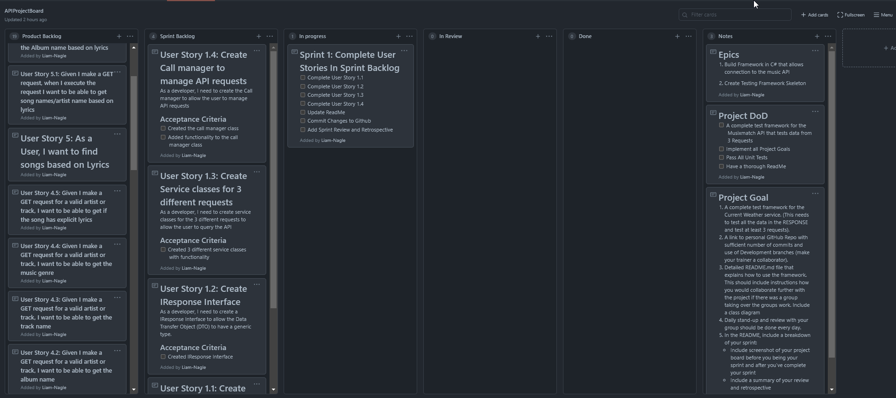
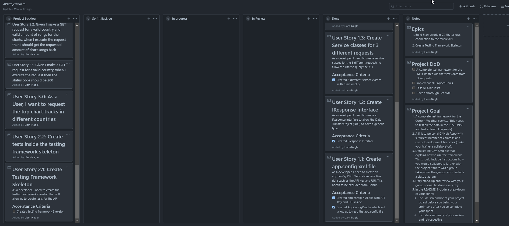

# APIProject Brief

## Project Description

Deliver a test framework for a REST API. The project is done as a group and working collaboratively through Scrum, GitHub and the current testing work.

## Project Deliverables

1. A complete test framework for the REST API you have chosen. (This needs to test all the data in the `RESPONSE` and test at least 3 requests).
2. A link to personal GitHub Repo with sufficient number of commits and use of Development branches (make your trainer a collaborator).
3. A project board (Github or Trello) with a Scrum framework to help plan out the project.
   - 6 columns - Product backlog, Sprint backlog, In progress, in Review, Done, Notes
   - Include your Project Goal and Project DoD in the 'Notes' column
   - **User stories** should be written from the perspective of the user ("1. As a User, I want to request information about a single postcode from the Postcode.io API, so that I receive data back about that postcode")
   - Create **test cases** for each user story ("1.1 Given I make a GET request for a valid postcode, when I execute the request, then the status code should be 200")
   - Create user stories for developing your testing framework ("2. Create Testing framework skeleton", "3.Create Single Postcode Service" etc)
   - Tasks such as 'Update readme' can be their own **task**
4. Detailed `README.md` file that explains how to use the framework. This should include instructions how you would collaborate further with the project if there was a group taking over the groups work. Include a class diagram
5. Daily stand-up and review with your group should be done every day.
6. In the README, include a breakdown of your sprint:
   - Include screenshot of your project board before you being your sprint and after you've complete your sprint
   - Include a summary of your review and retrospective
7. You will present your work as 5 minutes demo of your API framework

## Class Diagram

## Sprints

### Sprint 1

#### Kanban Board at the start

#### Sprint Goals

- [x] Complete User Story 1.1
- [x] Complete User Story 1.2
- [x] Complete User Story 1.3
- [x] Complete User Story 1.4
- [x] Update ReadMe
- [x] Commit Changes to GitHub
- [x] Add Sprint Review and Retrospective

#### Kanban Board at the end

#### Sprint Review

In this sprint we managed to complete all our user stories in the sprint backlog. We created the main "service" layer which allowed us to call methods within the API. We also added in some very basic Status Check tests to ensure these were working correctly.

#### Sprint Retrospective

We managed our time well in this sprint. Managing to complete all the user stories we set ourselves out to do. This was the first time working in a Collaborative GitHub environment. During the creation of one of our service layers however we ran into an issue with the way the JSON response was structured. This lead to a few problems when trying to query it to get data out. This was eventually fixed but did delay us quite a bit. During this period we all worked together to fix the bug as it was a blocker that held us up completing anything else. 

In the next sprint now that we have the Framework fully completed we will be looking to write a lot of unit tests to test all functionality and response types within the response as detailed in the deliverables.

#### Sprint 2

#### Kanban Board at the start

#### Sprint Goals

#### Kanban Board at the end

#### Sprint Review

#### Sprint Retrospective
